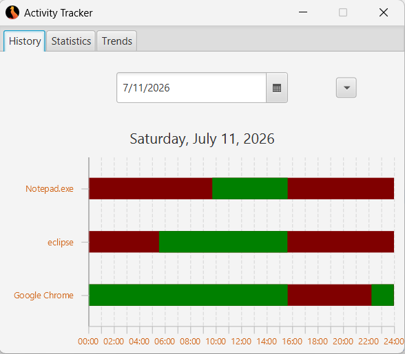
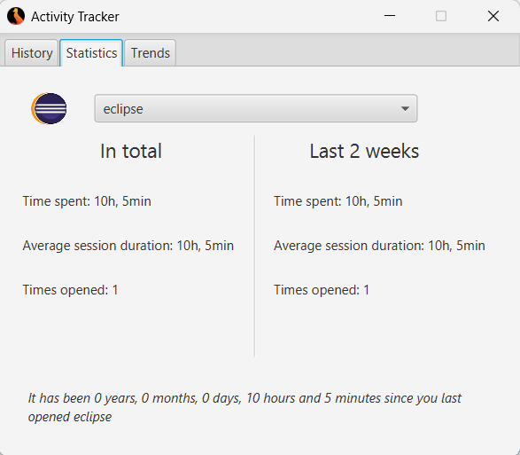
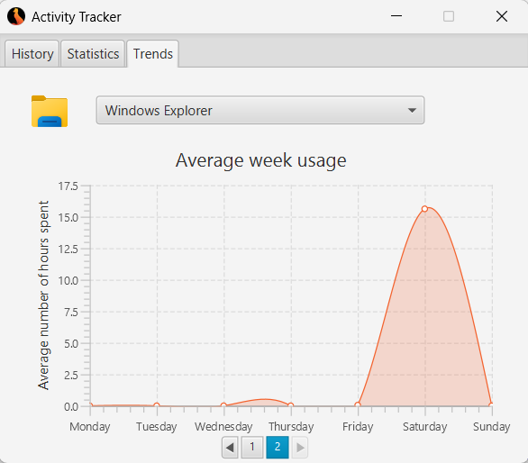

# Activity Tracker

A Java desktop application that runs in the background and tracks which applications you use and for how long. It records individual usage sessions, stores them locally, and provides charts and visualizations of your habits. Originally created for my Matura exam in 2021.

## Features

- **Session-based tracking** – Records application usage sessions with start and end timestamps.
- **Background operation** – Runs silently in the system tray.
- **History tab** – Browse past activity and see when you used specific applications.
- **Statistics tab** – View usage statistics, such as total time spent per application.
- **Trends tab** – See charts depicting trends in application usage.

## Screenshots

**History**  

**Statistics**  

**Trends**  

## Technologies Used

- **JavaFX** – UI framework
- **Maven** – Build and dependency management
- **Joda-Time** – Date and time handling
- **JIconExtractReloaded** – Application icon extraction

### Prerequisites

- Java 15 or higher
- Maven